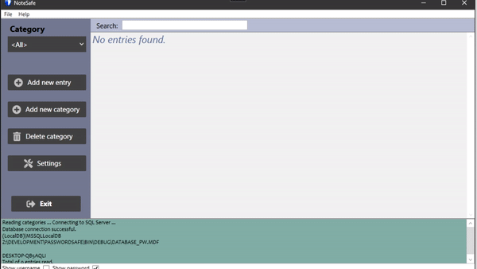

# NoteSafe
NoteSafe is a program where you can save your personal notes and user credentials. Notesafe utilizes a local database that stores all data. This database is safe and locked by a password.

## Table of contents
1. Installation
2. Tutorial

## Installation
- Download installation files from "Releases page". 
- After downloading the files, install using "NoteSafeSetup.msi"
- Microsoft LocalDB is required to run the software and can be found [here](https://go.microsoft.com/fwlink/?LinkID=866658).
  When installing LocalDB select only express LocalDB installation to save disk space.

## Tutorial
- First when the program opens up. There will be the main screen
- You have to add a category to start
- After that you can add entries
- Additionally you can generate a random password for a new login
- After adding an entry it will be shown on the main screen. And user credentials can be copied to clipboard.

